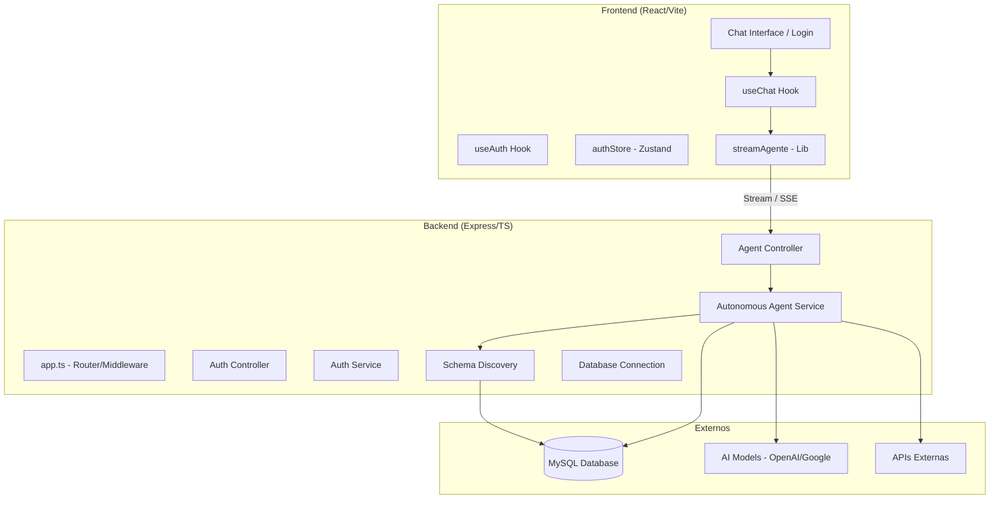

# 🛸 Proyecto Watto — Documentación Detallada

Bienvenido a la documentación oficial del proyecto **Watto**. Este documento tiene como objetivo explicar de manera clara y detallada el funcionamiento de la aplicación, tanto en el **Frontend (Vite/React)** como en el **Backend (Express/Node)**.

---

## 🏗️ Arquitectura General

El proyecto sigue una arquitectura desacoplada donde el Frontend consume una API REST/Streaming del Backend.

---

## ⚙️ Backend (Servidor)

### 🗂️ Estructura de Carpetas

- [src/app.ts](file:///home/srm/Desarrollo/Watto/src/app.ts): Punto de entrada. Configura Express, middlewares y arranca el servidor.
- `src/agent/`: Lógica central del agente inteligente.
    - `discovery/`: Herramientas para "descubrir" el esquema de la base de datos y APIs.
    - `tools/`: Implementación de los "Tools" que el agente puede ejecutar (SQL, API, etc.).
- `src/controllers/`: Manejadores de rutas. Reciben peticiones y llaman a servicios.
- `src/services/`: Lógica de negocio pesada (ej: autenticación).
- `src/repositories/`: Capa de acceso a datos pura (Consultas directas a DB).
- `src/models/`: Definición de estructuras de datos (Zod schemas o Interfaces).
- `src/routes/`: Definición de endpoints de la API.

### 🔑 Flujo de Autenticación
- **Origen**: `src/routes/auth.routes.ts` define `/api/auth/login`.
- **Implementación**: `auth.controller.ts` llama a `auth.service.ts`.
- **Lógica**: Se verifica el usuario en `usuario.repository.ts` (comparando hash en DB) y se genera un JWT.
- **Llamado por**: Frontend (`useAuth.ts`).

### 🤖 Flujo del Agente (Chat)
- **Origen**: `src/routes/agent.routes.ts` define `/api/agent/stream`.
- **Servicio Principal**: `autonomus-agent.service.ts`.
- **Funcionamiento**:
    1. **Inicialización**: Se escanea la DB y se construye el `systemPrompt`.
    2. **Streaming**: Se usa `streamText` de la librería `ai` (SDK de Vercel).
    3. **Herramientas**: Si el agente lo requiere, ejecuta `sql-executor.tool.ts` (para consultar la DB) o `api-executor.tool.ts`.
    4. **Exportación**: Si el agente decide exportar, genera un token `|||EXPORT_SQL...|||` que el controlador detecta para enviar una URL de descarga al frontend.

---

## 🎨 Frontend (Cliente)

### 🗂️ Estructura de Carpetas

- `client/src/main.tsx`: Punto de entrada del cliente. Configura `QueryClient` y `BrowserRouter`.
- `client/src/pages/`: Vistas principales (`LoginPage`, `ChatPage`).
- `client/src/hooks/`: Lógica reutilizable y estado complejo (ej: `useChat`).
- `client/src/stores/`: Estado global persistente (`authStore` con Zustand).
- `client/src/lib/`: Utilidades de bajo nivel y llamadas a API (`stream.ts`).
- `client/src/components/`: Piezas visuales de la interfaz.

### 💬 El Sistema de Chat (`useChat.ts`)
- **Origen**: `client/src/hooks/useChat.ts`.
- **Llamado por**: `ChatPage.tsx`.
- **Lógica**: Gestiona el historial de mensajes local y llama a `streamAgente`. Escucha eventos de texto, uso de herramientas y URLs de exportación.

### 🔐 Almacenamiento de Sesión (`authStore.ts`)
- **Herramienta**: Zustand + Middleware `persist`.
- **Ubicación**: `client/src/stores/authStore.ts`.
- **Uso**: El token se guarda en `localStorage` automáticamente y se inyecta en cada cabecera de las peticiones API a través del hook `useAuth`.

---

## 📊 Resumen de Proveniencia y Uso (Key files)

| Archivo | Origen (Declara) | Usado por (Llamado en) | Función Principal |
| :--- | :--- | :--- | :--- |
| `app.ts` | Backend Entry | Scripts del `package.json` | Configurar y arrancar servidor Express. |
| `autonomus-agent.service.ts` | Agent Logic | `agent.controller.ts` | El "Cerebro" que habla con el modelo de IA. |
| `sql-executor.tool.ts` | Agent Tool | `autonomus-agent.service.ts` | Permite al agente preguntarle a la base de datos MySQL. |
| `useAuth.ts` | Frontend Hook | `LoginPage.tsx`, `ChatPage.tsx` | Maneja el login y estado de sesión. |
| `useChat.ts` | Frontend Hook | `ChatPage.tsx` | Orquesta la conversación en tiempo real. |
| `stream.ts` | Frontend Lib | `useChat.ts` | Maneja la conexión SSE con el backend. |

---

## 💡 Notas para Modificaciones Futuras

1. **Agregar un nuevo Tool al Agente**:
    - Crea el tool en `src/agent/tools/`.
    - Regístralo en la función `getTools()` de `autonomus-agent.service.ts`.
2. **Cambiar el Estilo Visual**:
    - Las variables globales están en `client/src/index.css`.
    - Los componentes tipo Glassmorphism usan clases de CSS Vanilla personalizadas con variables de color.
3. **Optimizar Consultas**:
    - La base de datos se escanea una vez por hora (configurable en `autonomus-agent.service.ts`). Si cambias el esquema, usa `reiniciarAgente()` o borra `.schema-cache.json`.
